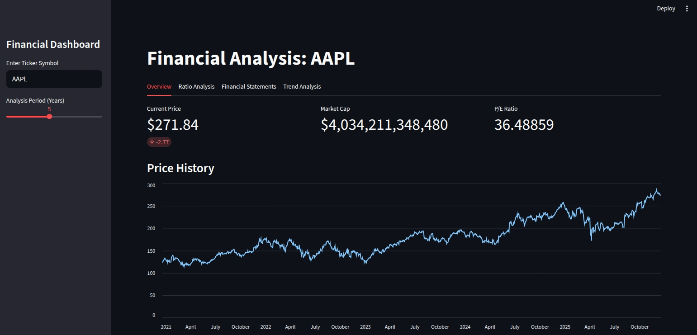
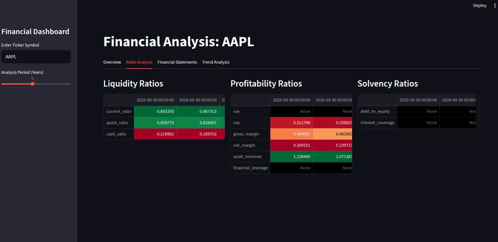
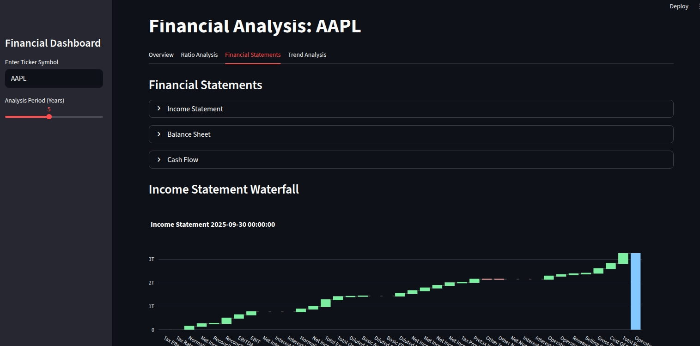
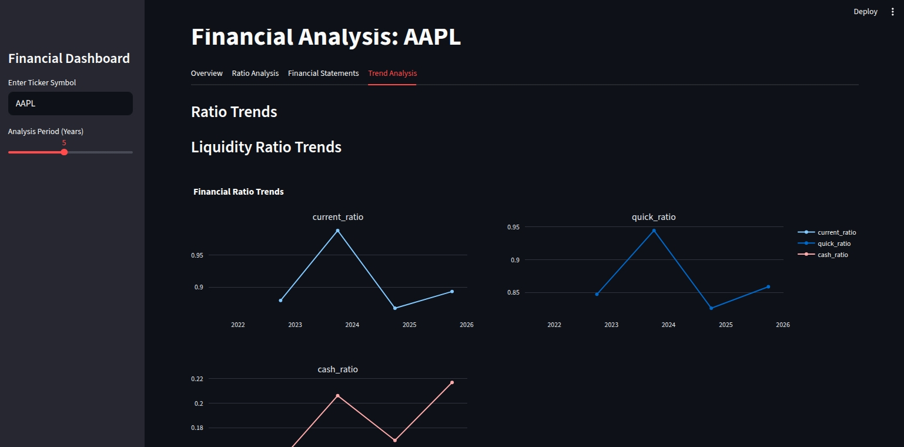

# Financial Dashboard

A web-based financial dashboard that provides a comprehensive overview of a company's financial health. Users can enter a stock ticker to view key financial metrics, analyze trends in financial ratios, and inspect financial statements. The application is built with Python and Streamlit, and it fetches data from the Yahoo Finance API.

<p float="left"> 
 
 


</p>

## Features

*   **Company Overview:** Displays key information about the company, including:
    *   **Current Stock Price:** The most recent trading price of the stock.
    *   **Market Capitalization:** The total market value of the company's outstanding shares.
    *   **P/E Ratio (Price-to-Earnings):** A measure of the company's current share price relative to its per-share earnings.
*   **Price History:** An interactive chart showing the historical stock price for the selected period.
*   **Ratio Analysis:** Calculates and displays key financial ratios, categorized into:
    *   **Liquidity Ratios:** Measures a company's ability to meet its short-term obligations.
        *   **Current Ratio:** Current Assets / Current Liabilities
        *   **Quick Ratio:** (Current Assets - Inventory) / Current Liabilities
        *   **Cash Ratio:** Cash and Cash Equivalents / Current Liabilities
    *   **Profitability Ratios:** Measures a company's ability to generate profits from its sales or operations.
        *   **Return on Equity (ROE):** Net Income / Average Total Equity
        *   **Return on Assets (ROA):** Net Income / Average Total Assets
        *   **Gross Margin:** (Revenue - Cost of Goods Sold) / Revenue
        *   **Net Margin:** Net Income / Revenue
        *   **Asset Turnover:** Revenue / Average Total Assets
        *   **Financial Leverage:** Average Total Assets / Average Total Equity
    *   **Solvency Ratios:** Measures a company's ability to meet its long-term obligations.
        *   **Debt-to-Equity:** Total Debt / Total Equity
        *   **Interest Coverage:** EBIT / Interest Expense
*   **Financial Statements:** Displays the company's annual financial statements:
    *   Income Statement
    *   Balance Sheet
    *   Cash Flow Statement
*   **Trend Analysis:** Visualizes the trends of the calculated financial ratios over the selected period.
*   **File-Based Caching:** Implements a file-based caching mechanism to improve performance and allow for offline use of cached data.

## How to Use

1.  **Enter a Ticker Symbol:** In the sidebar, enter the stock ticker symbol for the company you want to analyze (e.g., AAPL for Apple, GOOGL for Google).
2.  **Select Analysis Period:** Use the slider in the sidebar to choose the number of years for the analysis.
3.  **Explore the Tabs:**
    *   **Overview:** Get a quick snapshot of the company's current financial status and price history.
    *   **Ratio Analysis:** Dive deep into the company's financial ratios.
    *   **Financial Statements:** Inspect the raw financial statements.
    *   **Trend Analysis:** Visualize how the financial ratios have changed over time.

## Project Structure

```
.
├── app/
│   └── streamlit_app.py    # Main Streamlit application
├── data/                   # Directory for cached data
├── src/
│   ├── data_fetcher.py     # Fetches data from Yahoo Finance
│   ├── ratio_calculator.py # Calculates financial ratios
│   └── visualizer.py       # Creates visualizations
├── requirements.txt        # Project dependencies
└── README.md
```

## Getting Started

### Prerequisites

*   Python 3.8+
*   pip

### Installation

1.  Clone the repository:
    ```bash
    git clone https://github.com/your-username/financial_dashboard.git
    ```
2.  Navigate to the project directory:
    ```bash
    cd financial_dashboard
    ```
3.  Create and activate a virtual environment (recommended):
    ```bash
    python -m venv venv
    source venv/bin/activate  # On Windows, use `venv\Scripts\activate`
    ```
4.  Install the required dependencies:
    ```bash
    pip install -r requirements.txt
    ```

### Running the Application

```bash
streamlit run app/streamlit_app.py
```

## Data Source

The financial data is fetched from the [Yahoo Finance API](https://finance.yahoo.com/) using the `yfinance` library.

## Caching

This application uses a file-based caching system to store data fetched from the Yahoo Finance API. The cached data is stored in the `data/` directory. This has the following benefits:

*   **Improved Performance:** Reduces the number of API calls, making the application faster on subsequent loads for the same ticker.
*   **Offline Access:** Allows the application to be used without an internet connection if the data has been previously cached.

The cache is automatically invalidated after 24 hours.

## Contributing

Contributions are welcome! If you have any ideas for improvements or new features, feel free to open an issue or submit a pull request.

## License

This project is licensed under the MIT License - see the [LICENSE](LICENSE) file for details.